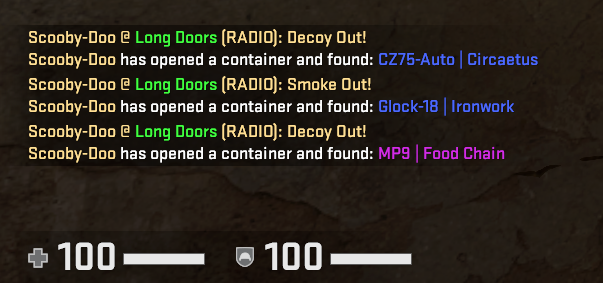
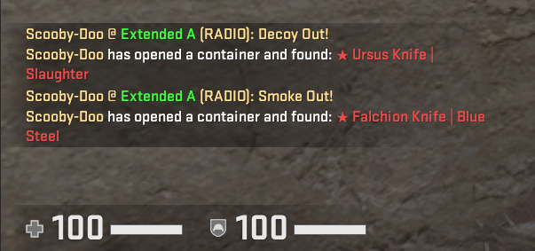

# CSGO Radio Troll
Let's you fake item unbox messages in chat without the need to even open the developer console.

Inspired by [video](https://youtu.be/WMN_A_NC5DQ) from Anomaly. Works on the same principle, but automated with big (and configurable) range of items.

## Setup

1. Install the keyboard library using `pip install keyboard`

2. Add `-netconport 2323` to the CSGO launch options

3. Run the script using `python main.py`

4. Press the button specified in the `config.py` *('v' by default)*

## Config
In config.py you can change multiple settings before running the script.

`KEYBIND`: Key to send a fake radio message *('v' by default)*

`PLAYERNAME`: Changes the "unboxers" player name *(You can use your nickname or someone elses from your team)*

`BLUE_UNBOX_CHANCE`: Chance of "unboxing" a blue item *(In %, max. 2 decimal places)*

`PINK_UNBOX_CHANCE`: Chance of "unboxing" a pink item *(In %, max. 2 decimal places)*

`KNIFE_UNBOX_CHANCE`: Chance of "unboxing" a knife *(Setting this to 100% guarantees a fake knife unbox message)*

`DECOY_OUT_CHANCE`: Chance of showing a `"Decoy Out!"` message after `(RADIO):` *(In %, max. 2 decimal places)*

`FLASHBANG_OUT_CHANCE`: Chance of showing a `"Flashbang Out!"` message after `(RADIO):` *(In %, max. 2 decimal places)*

`SMOKE_OUT_CHANCE`: Chance of showing a `"Smoke Out!"` message after `(RADIO):` *(In %, max. 2 decimal places)*

`NO_RADIO_VOICEMESSAGE_CHANCE`: Chance of not showing a message after `(RADIO):` *(Setting this to 0% guarantees a Decoy/Flashbang/Smoke message)*

## Disclaimer
This script does not inject in game and only uses native elements of the CSGO provided by Valve (Telnet communication with game console). However, I am not a Valve employee, so I can NOT guarantee, that this script is 100% VAC-Safe.
